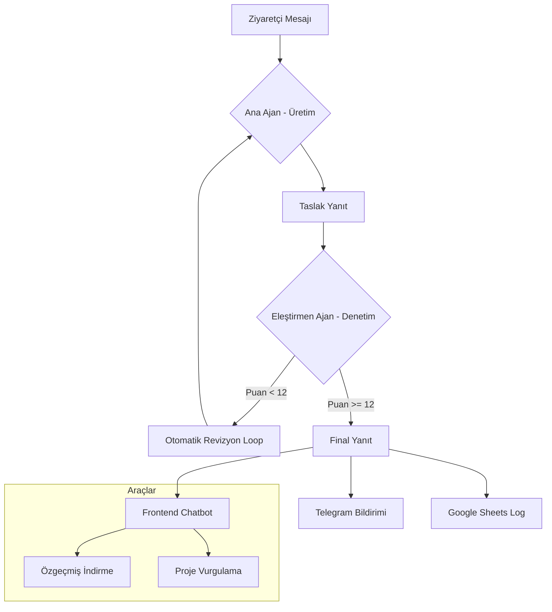

# AI Kariyer Asistanı - Mimari Dokümantasyon

Bu proje, bir "Human-in-the-Loop" (İnsan Denetimli) AI Ajan sistemidir. Berk Kocabörek'in portföy sitesine entegre edilmiş olup, potansiyel işverenlerle profesyonel iletişimi yönetir.

## 1. Sistem Bileşenleri (System Components)

Sistem 4 ana birimden oluşur:

1. **Ana Ajan (Career Agent):** Kullanıcı mesajlarını alır, Berk'in kimliği ve teknik yetkinlikleri ile (Context) profesyonel yanıtlar üretir. 
2. **Değerlendirici Ajan (Self-Critic Agent):** Üretilen yanıtı mesaj gönderilmeden önce denetler. Halüsinasyon, tonlama ve güvenlik kontrolü yapar.
3. **Araçlar (Tools):** `download_cv` (Özgeçmiş indir) ve `search_projects` (Proje arama) gibi dinamik aksiyonları yürütür.
4. **Bildirim Sistemi (Notifier):** Telegram Bot API üzerinden her etkileşimi yöneticiye (Berk) raporlar.

## 2. Ajan Döngüsü (Agent Loop)

Sistem bir **Linear Reasoning & Verification Loop** kullanır:

1. **Girdi:** Kullanıcıdan gelen mesaj ve konuşma geçmişi.
2. **Generation:** Ana Ajan, `SYSTEM_PROMPT` direktiflerine göre taslak yanıt oluşturur.
3. **Critic:** Değerlendirici Ajan, taslak yanıtı 3 kriterde (Ton, Doğruluk, Uygunluk) puanlar.
4. **Revision:** Eğer puan eşiğin (12/15) altındaysa, eleştiri geri bildirimi ile yanıt otomatik olarak revize edilir.
5. **Output:** Sonuç kullanıcıya iletilir, eş zamanlı olarak Telegram ve Google Sheets'e kaydedilir.

## 3. Akış Diyagramı (Flow Diagram)

## 4. Prompt Tasarımı (Prompt Engineering)

- **System Prompt:** Berk'in tüm teknik geçmişi, sertifikaları ve "Kariyer Hedefi" bağlam olarak verilmiştir. "Profesyonel & Nazik" ses tonu (Tone of Voice) katı kurallarla tanımlanmıştır.
- **Self-Critic Prompt:** Bir "Hakem" rolü tanımlanmıştır. JSON çıktı formatı dayatılarak sistemin programatik olarak puan okuması sağlanmıştır.

## 5. Güven Yönetimi (Uncertainty & Unknowns)

Sistem, hakkında bilgisi olmadığı konularda (örneğin maaş pazarlığı veya dökümanda olmayan çok derin teknik detaylar) uydurma bilgi vermemek üzere programlanmıştır. Bu durumlarda mesajı `[UNKNOWN]` etiketiyle işaretler ve yöneticiye anında **"Kritik Müdahale Gerekli"** bildirimi gönderir.
