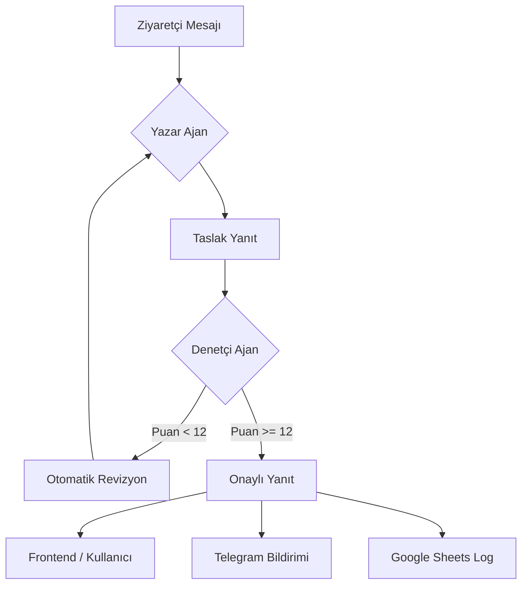

# AI Kariyer Asistanı - Proje Raporu

Merhaba, portfolyom için geliştirdiğim bu asistanın arkasındaki mantığı, karşılaştığım zorlukları ve sistemi nasıl kurguladığımı bu raporda özetledim.

## 1. Tasarım Kararlarım

Bu projeyi sadece bir chatbot değil, gerçekten beni temsil edebilecek güvenilir bir "asistan" olarak tasarladım.

- **Teknoloji Seçimi**: Cloudflare Workers üzerinde Meta'nın **Llama 3.3 70B** modelini kullandım. 70B olması, karmaşık hataları ayıklamada ve profesyonel tonu korumada çok daha başarılı sonuçlar veriyor.
- **Telegram & Google Sheets**: Sistemde olan biten her şeyi anlık olarak Telegram'dan takip ediyorum. Bu sayede "Human-in-the-loop" (İnsan denetimli) bir akış sağladım.

## 2. Değerlendirme Stratejim

Asistanın performansını ölçmek için birkaç farklı katman kullanıyorum:

- **Otomatik Puanlama**: Denetçi ajan, her cevaba 1-15 arası bir puan veriyor (Ton, Doğruluk, Uygunluk). Eğer puan 12'nin altındaysa, cevap otomatik olarak baştan yazılıyor.
- **Kritik Senaryo Testleri**: Mülakat davetleri, teknik sorular ve maaş pazarlığı gibi durumları simüle ettim.

## 3. Karşılaştığım Zorluklar ve Çözümler

Her projede olduğu gibi burada da bazı teknik limitlere takıldım:

- **Token ve Hafıza**: Ücretsiz sürümdeki kısıtlar nedeniyle asistanın "hafızasını" son 6 mesajla sınırladım. Ayrıca sadece ilgili projeleri bağlama ekleyerek yer tasarrufu sağladım.
- **Hız vs. Kalite**: İki aşamalı kontrol cevabı 1-2 saniye geciktiriyor. Ancak portfolyomda yanlış bir cevap görmektense, kaliteli bir cevap için 2 saniye beklemenin daha mantıklı olduğuna karar verdim.
- **Bilinmeyen Sorular**: Hakkımda dökümanda olmayan bir şey sorulduğunda asistanın "uydurmaması" için katı kurallar koydum. Bu durumlarda asistan topu bana atıyor ve bana Telegram'dan bildirim düşüyor.

## 4. Geriye Bakış

Bu süreçte şunu öğrendim: Bir yapay zekaya hata yapmamasını söylemek yerine, hata yaptığında onu düzeltecek ikinci bir göz eklemek çok daha etkiliymiş. Multi-agent yapısı sistemin güvenilirliğini inanılmaz artırdı.

---

### Sistem Akışı

